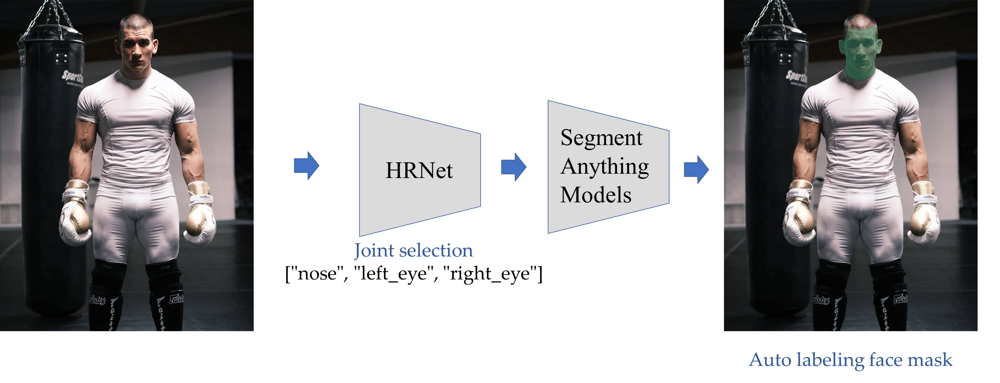
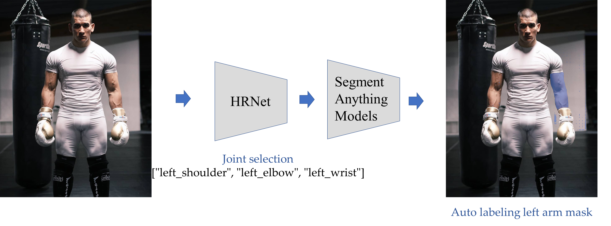
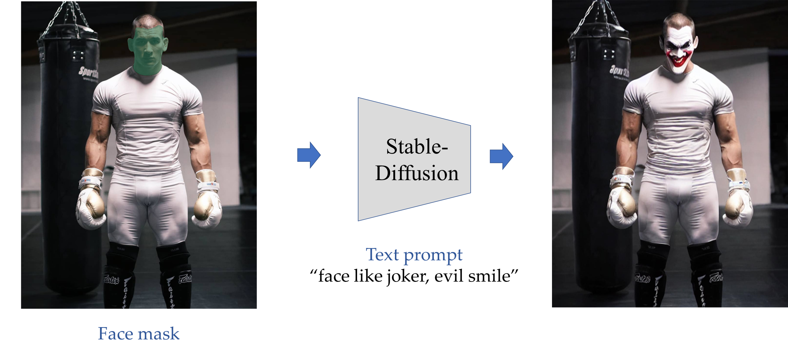
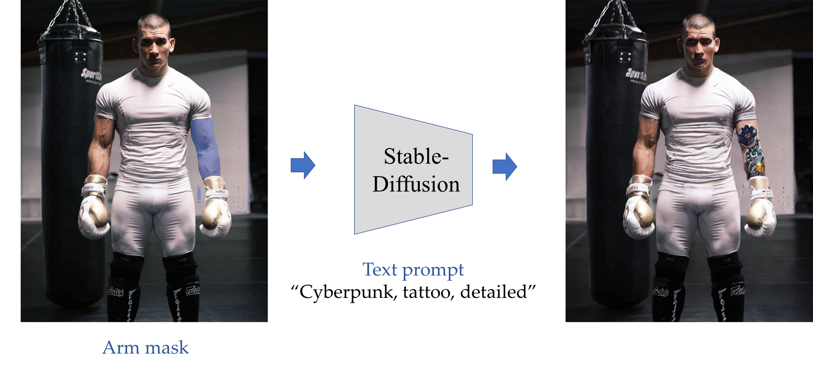
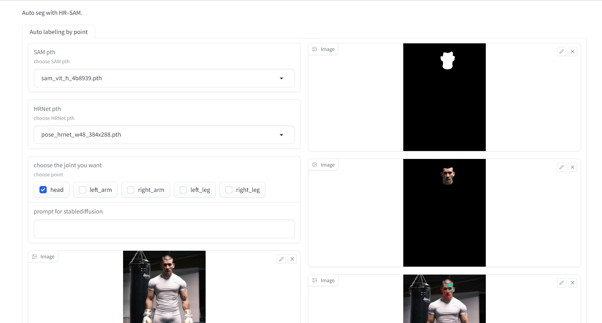
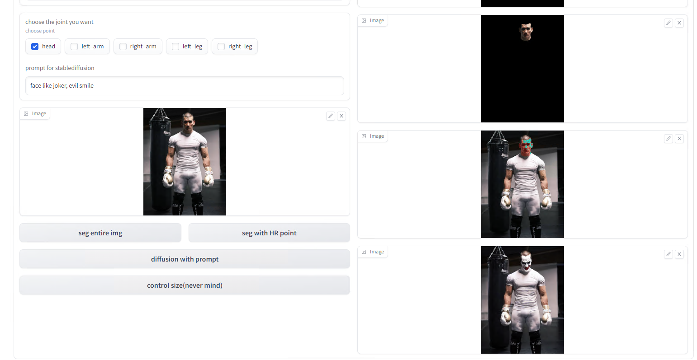

# Pose-Segment-Anything
The **core idea** behind this project is inspired by [Grounded-Segment-Anything](https://github.com/IDEA-Research/Grounded-Segment-Anything). We are going to **combine the pose estimation models in order to better use the point prompt of [Segment Anything](https://github.com/facebookresearch/segment-anything) instead of box prompt. And then we can edit any part we want of our body with [stable diffusion](https://github.com/CompVis/stable-diffusion). a very interesting workflow pipeline for combining strong expert models**.


## Demo Preview
**HR-SAM:Automatic Labeling Components of the human body**





**HR-SAM-Stable-Diffusion Inpainting:Editing any Components of the human body**





**WebUI_DEMO with gradio**

First choose the pth of SAM and HRNet, then select the Components you want and click Seg with HR prompt.

Then write your text prompt and diffusion with previous mask to edit it to whatever you want.



### How to start

1.Check the requirements.txt
```
pip install -r requirements.txt 
```
2.Download pth of SAM and HRNet

Here is the link:[SAM](https://dl.fbaipublicfiles.com/segment_anything/sam_vit_h_4b8939.pth). [HRNet](https://drive.google.com/file/d/1UoJhTtjHNByZSm96W3yFTfU5upJnsKiS/view).

3.Execute demo of HR-SAM of HR-SAM-Diffusion with your own image.

4.Execute appHRSAMDIFF.py Have fun with WebUI and get your own 'Human body modification program'

### Contributors

Yuming Qiao, Fanyi Wang, Yanhao Zhang

